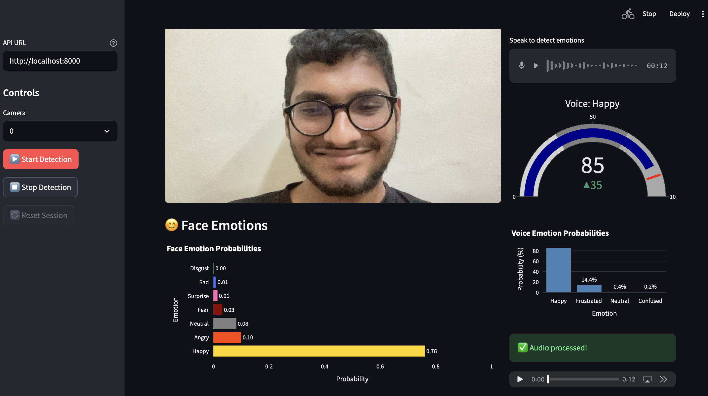
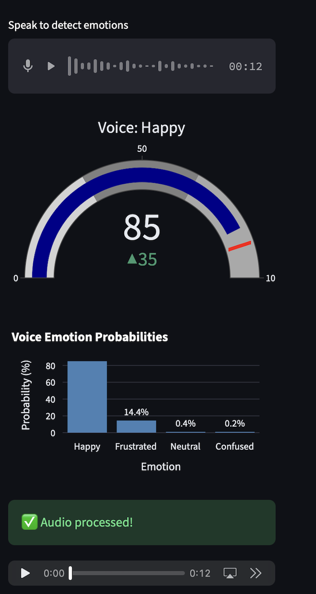
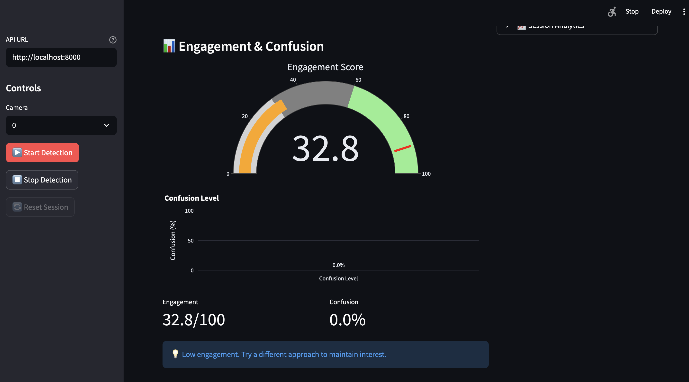

# Emotion-Aware AI Tutoring System

## Problem Statement

Traditional online learning platforms lack real-time awareness of student emotional states, leading to ineffective teaching interventions. When students become confused or frustrated during learning sessions, instructors cannot detect these emotional cues until it is too late, resulting in disengagement and poor learning outcomes. This problem is particularly acute in remote learning environments where visual and auditory emotional signals are the primary indicators of student comprehension.

Success is defined as accurately detecting student emotions in real-time (both facial expressions and voice patterns) and providing adaptive tutoring responses that improve learning engagement and comprehension.

## Objective

This project aims to build a multimodal emotion recognition system that:
- Detects facial emotions from video streams in real-time
- Detects voice emotions from audio recordings
- Calculates engagement and confusion metrics from emotional patterns
- Generates adaptive tutoring responses based on detected emotional states
- Provides an interactive dashboard for visualization and analysis

The system must operate in real-time with low latency, support standard webcams and microphones, and achieve emotion classification accuracy above 80% for practical deployment.

## Dataset

**Face Emotion Recognition:**
- Dataset: FER-2013 (Facial Expression Recognition 2013)
- Source: Kaggle
- Type: Image data (structured)
- Size: ~28,709 training images, ~3,589 test images
- Format: 48x48 grayscale images
- Classes: 7 emotions (Angry, Disgust, Fear, Happy, Sad, Surprise, Neutral)
- Preprocessing: Normalization to [0,1], data augmentation (horizontal flip)

**Speech Emotion Recognition:**
- Datasets: CREMA-D, TESS, SAVEE
- Sources: CREMA-D (Crowd-sourced Emotional Multimodal Actors Dataset), TESS (Toronto Emotional Speech Set), SAVEE (Surrey Audio-Visual Expressed Emotion)
- Type: Audio data (unstructured, time-series)
- Size: Combined ~8,500+ audio samples
- Format: WAV files, 16kHz sample rate
- Classes: 4 learning-centric emotions (Happy, Neutral, Confused, Frustrated)
- Preprocessing: 
  - Sample rate normalization to 16kHz
  - Silence trimming using librosa
  - Data augmentation (background noise, pitch shift ±2 semitones, time stretch 0.9-1.1)
  - Feature extraction: 40 MFCCs + 12 Chroma features + 128 Mel spectrogram + Zero Crossing Rate = 181-dimensional feature vector

## Approach

**Architecture Design:**
The system employs a multimodal approach combining computer vision and audio processing pipelines. Face emotions are detected using a CNN architecture trained on FER-2013, while voice emotions use a CNN-BiLSTM-Attention model that captures both spatial and temporal patterns in audio features.

**Face Emotion Recognition:**
- CNN architecture with convolutional layers for feature extraction
- Fully connected layers for 7-class classification
- Real-time inference using MediaPipe for face detection

**Speech Emotion Recognition:**
- CNN layers for spatial feature extraction from audio feature vectors
- Bidirectional LSTM layers for temporal pattern recognition
- Attention mechanism to focus on emotion-relevant time steps
- Dense layers for 4-class classification
- Feature engineering: Comprehensive audio feature extraction (MFCCs, Chroma, Mel, ZCR)

**Training Strategy:**
- Face model: Standard train/test split (80/20), data augmentation
- Speech model: Train/validation/test split (70/15/15), stratified sampling
- Class balancing using weighted random sampling for speech model
- Early stopping with patience=20 to prevent overfitting
- Learning rate scheduling with ReduceLROnPlateau

## Model & Techniques Used

**Machine Learning Models:**
- CNN (Convolutional Neural Network) for face emotion recognition
- CNN-BiLSTM-Attention for speech emotion recognition
- Batch normalization and dropout for regularization

**Feature Engineering:**
- MFCC (Mel-frequency Cepstral Coefficients) for audio
- Chroma features for pitch class representation
- Mel spectrogram for frequency domain analysis
- Zero Crossing Rate for temporal characteristics
- Data augmentation (noise injection, pitch shifting, time stretching)

**Libraries and Frameworks:**
- PyTorch for model development and training
- FastAPI for REST API backend
- Streamlit for interactive dashboard
- librosa and soundfile for audio processing
- OpenCV and MediaPipe for face detection
- scikit-learn for data splitting and evaluation metrics
- NumPy and Pandas for data manipulation

## Evaluation Metrics

**Primary Metrics:**
- Accuracy: Overall classification correctness
- F1-Score (weighted): Harmonic mean of precision and recall, accounting for class imbalance
- Per-class precision, recall, and F1-score for detailed analysis

**Why These Metrics:**
- Accuracy provides an overall performance measure
- F1-score addresses class imbalance in emotion datasets
- Per-class metrics reveal performance variations across emotion categories
- Confusion matrices visualize misclassification patterns

**Validation Strategy:**
- Face model: Standard test set evaluation
- Speech model: Stratified train/validation/test splits to maintain class distribution
- No cross-validation due to computational constraints, but held-out test set provides unbiased performance estimate

## Results

**Speech Emotion Recognition Model:**
- Test Accuracy: 92.51%
- Test F1-Score (weighted): 0.9255
- Validation Accuracy: 93.56%
- Training completed in 15 epochs

**Per-Class Performance:**
- Happy: Precision 0.84, Recall 0.96, F1 0.90
- Neutral: Precision 0.86, Recall 1.00, F1 0.93
- Confused: Precision 0.93, Recall 0.95, F1 0.94
- Frustrated: Precision 0.99, Recall 0.88, F1 0.93

**Key Insights:**
- All emotion classes achieved F1-scores above 0.90, indicating robust performance
- Neutral emotion shows perfect recall (1.00), suggesting high sensitivity
- Frustrated emotion shows highest precision (0.99), indicating low false positive rate
- The 4-class learning-centric mapping (merging anger, fear, disgust into "frustrated") improved class balance and interpretability

**Limitations:**
- Model trained on actor-performed emotions, may not generalize to natural student expressions
- Real-time audio processing requires minimum 0.5 seconds of audio
- Performance depends on audio quality and background noise levels
- Face emotion detection requires clear frontal face view

## Business / Real-World Impact

**Practical Applications:**
- Online learning platforms can integrate this system to monitor student engagement in real-time
- Educational institutions can identify struggling students early and provide timely interventions
- Corporate training programs can adapt content delivery based on learner emotional states
- Researchers can study emotional patterns in learning contexts

**Stakeholders Who Benefit:**
- Students: Receive personalized, emotionally-aware tutoring assistance
- Educators: Gain insights into student comprehension without direct observation
- Educational administrators: Identify at-risk students and optimize curriculum delivery
- EdTech companies: Differentiate products with emotion-aware features

**Decision-Enabling Capabilities:**
- Real-time identification of confusion triggers specific content explanations
- Frustration detection prompts alternative teaching approaches
- Engagement metrics inform session pacing and difficulty adjustment
- Emotional trend analysis supports long-term learning path optimization

## Project Structure

```
emotion-ai-tutor-2/
├── backend/                 # FastAPI backend server
│   ├── api.py              # Main API endpoints
│   ├── inference_face.py   # Face emotion inference engine
│   ├── inference_audio.py  # Speech emotion inference engine
│   ├── engagement.py       # Engagement and confusion calculation
│   ├── tutor.py            # Adaptive tutoring logic
│   └── utils/              # Utility modules (face detection, logging)
├── app/                     # Streamlit frontend
│   ├── streamlit_app.py    # Main dashboard application
│   └── components/         # Reusable UI components
│       ├── emotion_meter.py
│       ├── voice_gauge.py
│       ├── engagement_bar.py
│       └── tutor_chatbox.py
├── models/                  # Trained models and model definitions
│   ├── speech_emotion_model.py    # CNN-BiLSTM-Attention architecture
│   ├── speech_emotion_model.pth   # Trained speech model weights
│   └── speech_emotion_confusion_matrix.png
├── notebooks/               # Jupyter notebooks for training
│   ├── train_face_emotion.ipynb
│   └── train_audio_emotion.ipynb
├── utils/                   # Data preprocessing utilities
│   ├── preprocessing_face.py
│   └── preprocessing_audio_speech_emotion.py
├── data/                    # Dataset storage and cache
│   ├── fer2013/            # FER-2013 dataset
│   ├── Crema/              # CREMA-D dataset
│   ├── Tess/               # TESS dataset
│   ├── Savee/              # SAVEE dataset
│   └── processed/          # Preprocessed data cache
├── train_speech_emotion.py  # Standalone training script
├── requirements.txt         # Python dependencies
└── README.md               # This file
```

## How to Run This Project

**Prerequisites:**
- Python 3.8+
- pip package manager
- Webcam and microphone (for real-time inference)

**Step 1: Clone the Repository**
```bash
git clone <repository-url>
cd emotion-ai-tutor-2
```

**Step 2: Create Virtual Environment**
```bash
python3 -m venv venv
source venv/bin/activate  # On Windows: venv\Scripts\activate
```

**Step 3: Install Dependencies**
```bash
pip install -r requirements.txt
```

**Step 4: Prepare Datasets**
- Download FER-2013 dataset and place in `data/fer2013/`
- Download CREMA-D, TESS, and SAVEE datasets and place in `data/Crema/`, `data/Tess/`, and `data/Savee/` respectively
- Preprocessed data will be cached automatically on first run

**Step 5: Train Models (Optional)**
```bash
# Train speech emotion model
python train_speech_emotion.py \
  --crema-dir data/Crema \
  --tess-dir data/Tess \
  --savee-dir data/Savee \
  --epochs 15
```

**Step 6: Start Backend API**
```bash
uvicorn backend.api:app --reload
```
The API will be available at `http://localhost:8000`

**Step 7: Start Streamlit Dashboard**
```bash
streamlit run app/streamlit_app.py
```
The dashboard will open in your browser at `http://localhost:8501`

**Step 8: Use the Application**
- Click "Start Detection" to begin face emotion recognition from webcam
- Use the microphone input to record audio for voice emotion detection
- View real-time emotion probabilities, engagement scores, and confusion levels
- Interact with the adaptive tutor chat feature

## Outputs

The system provides real-time visualization of detected emotions through an interactive dashboard. The interface displays live video feed, emotion probabilities, engagement metrics, and adaptive tutoring responses.



**Face Emotion Detection Interface:**


- Live video feed from webcam showing the user's face in real-time
- Horizontal bar chart showing probability distribution across 7 face emotions (Happy, Sad, Angry, Fear, Surprise, Disgust, Neutral)
- Dominant emotion highlighted with highest probability (e.g., Happy at 85%)
- Color-coded bars for visual interpretation (Yellow for Happy, Gray for Neutral, Blue for Sad, Red for Angry)

**Voice Emotion Detection Interface:**



- Audio recording interface with microphone input and timer display
- Gauge chart displaying top detected voice emotion with confidence percentage (e.g., "Happy (95.60%)")
- Bar chart showing all 4 voice emotion probabilities (Happy, Neutral, Confused, Frustrated)
- Real-time updates as audio is processed

**Engagement and Confusion Metrics:**



- Semi-circular gauge displaying engagement score (0-100) with visual zones
- Confusion level line graph showing temporal trends over time
- Real-time updates as emotions are detected
- Color-coded indicators for different engagement levels
- Dominant emotion display with high confidence percentages

**Adaptive Tutoring:**
- Tutor chat interface that responds to detected emotional states
- Session analytics section for tracking learning patterns over time
- Control panel with camera selection, start/stop detection, and session reset buttons

## Future Improvements

**Model Enhancements:**
- Fine-tune models on student-specific emotional expressions for better generalization
- Implement transfer learning from larger emotion recognition datasets
- Explore transformer-based architectures for improved temporal modeling
- Add multi-modal fusion techniques to combine face and voice emotions more effectively

**Data Improvements:**
- Collect real student emotion data in learning contexts
- Increase dataset diversity with more speakers and recording conditions
- Add emotion intensity labels (low/medium/high) for finer-grained detection
- Include contextual features (time of day, learning topic, session duration)

**Deployment and Scaling:**
- Containerize application using Docker for consistent deployment
- Implement model serving infrastructure (TensorFlow Serving, TorchServe)
- Add user authentication and session management
- Support multiple concurrent users with load balancing
- Deploy to cloud platforms (AWS, GCP, Azure) for scalable access

**Feature Additions:**
- Long-term emotion trend analysis and reporting
- Integration with Learning Management Systems (LMS)
- Mobile app support for on-the-go learning
- Multi-language emotion recognition
- Personalized emotion sensitivity thresholds

## Key Learnings

**Technical Learnings:**
- CNN-BiLSTM-Attention architectures effectively capture both spatial and temporal patterns in audio emotion recognition
- Comprehensive feature engineering (MFCCs + Chroma + Mel + ZCR) significantly improves model performance compared to MFCCs alone
- Class balancing through weighted sampling is crucial for imbalanced emotion datasets
- Real-time inference requires careful optimization of preprocessing pipelines
- Multi-modal systems benefit from asynchronous processing to maintain low latency

**Data Science Learnings:**
- Mapping raw emotions (anger, fear, disgust) to learning-centric categories (frustrated) improves both class balance and interpretability
- Data augmentation (noise, pitch shift, time stretch) effectively increases dataset size and model robustness
- Early stopping and learning rate scheduling are essential for preventing overfitting in deep learning models
- Evaluation metrics must align with business objectives (F1-score for class imbalance, per-class metrics for interpretability)
- Real-world deployment requires handling edge cases (silence, poor audio quality, occluded faces)

**Project Management Learnings:**
- Modular architecture (separate inference engines, preprocessing, training) facilitates development and maintenance
- Clear separation between training scripts and inference code enables independent updates
- Comprehensive error handling and logging are critical for production systems
- User interface design significantly impacts system usability and adoption

## References

**Datasets:**
- FER-2013: Goodfellow, I. et al. (2013). "Challenges in Representation Learning: A report on the machine learning contest of ICML 2013"
- CREMA-D: Cao, H. et al. (2014). "CREMA-D: Crowd-sourced Emotional Multimodal Actors Dataset"
- TESS: Dupuis, K. & Pichora-Fuller, M. K. (2010). "Toronto Emotional Speech Set (TESS)"
- SAVEE: Jackson, P. & Haq, S. (2014). "Surrey Audio-Visual Expressed Emotion (SAVEE) Database"

**Techniques and Frameworks:**
- PyTorch Documentation: https://pytorch.org/docs/stable/index.html
- FastAPI Documentation: https://fastapi.tiangolo.com/
- Streamlit Documentation: https://docs.streamlit.io/
- librosa Audio Processing: McFee, B. et al. (2015). "librosa: Audio and Music Analysis in Python"

**Related Work:**
- Emotion recognition in educational contexts: research on affective computing for learning
- Multimodal emotion recognition: combining visual and auditory cues
- Real-time emotion detection: latency optimization techniques for live systems

